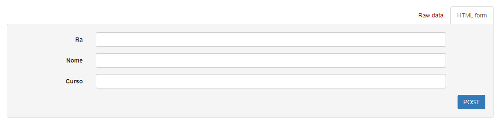
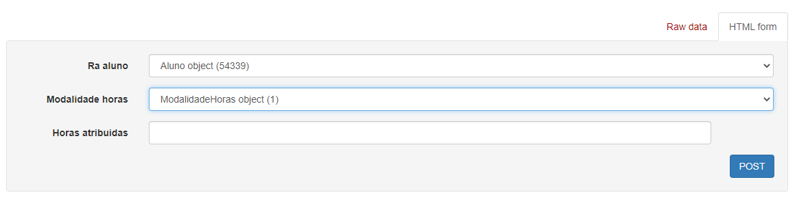
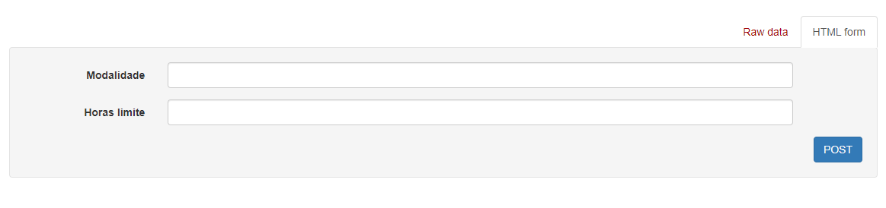

## 1- CADASTRO DE ALUNO

## 2- CADASTRO DE HORAS PARA ALUNO

## 3- CADASTRO DE CRIAÇÃO DE MODALIDADE

## ☕ Introdução

Este projeto é um projeto integrador, que foi realizado na materia de Tópicos Especiais Em Tecnologia no curso de Analise e Desenvolvimento de Sistemas. 
Este projeto simula um sistema gerenciador de Horas Complementares.

## PRÉ-VISUALIZAÇÃO 
  https://agyl-horas.herokuapp.com/horas-complementares/

## 💻 Pré-requisitos

Antes de começar, verifique se você atendeu aos seguintes requisitos:

* Você tem uma máquina Windows / Linux / Mac.
* Você tem instalado a versão 8 do JAVA no seu computador ou superior.

[⬆ Voltar ao topo](#AGYL) 

